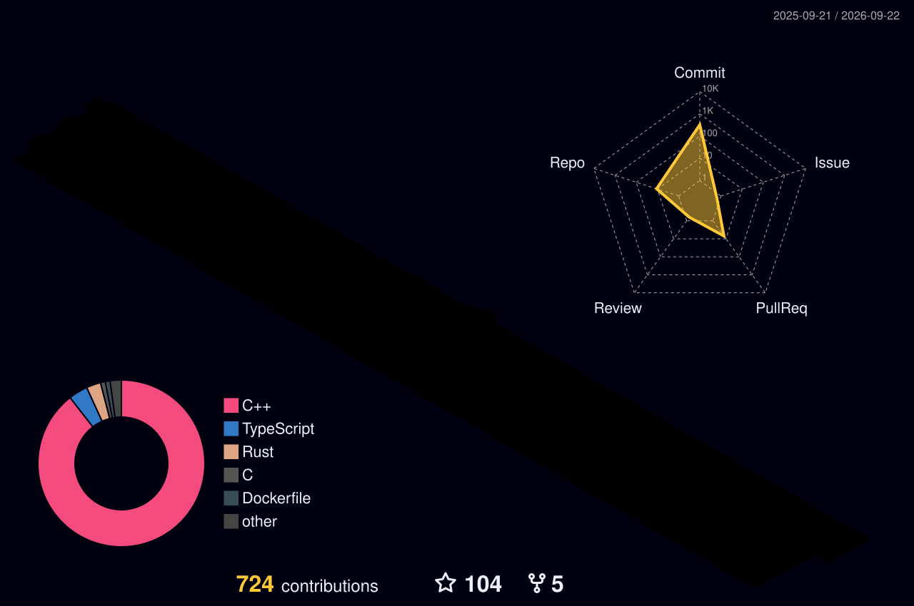

// <h1 align="center">reidlo</h1>

 
 

##  Technologies

<kbd>
  <kbd>
    <kbd>Languages</kbd>
     
     
    
    
    
    
    
    
    
  </kbd>
  <kbd>
    <kbd>OS</kbd>
     
     
    
    
  </kbd>
  <kbd>
    <kbd>Library / FrameWorks</kbd>
     
    
    
    
    
    
    
    
  </kbd>
  <kbd>
    <kbd>Cloud</kbd>
     
    
    
  </kbd>
</kbd>

 
 

##  Github Stats

 
 

<h2 align="left">⚡Activity Graph:</h2>

 
 

## Github Metrics

  

  

 
<b>Visitors Count</b>
  

 

